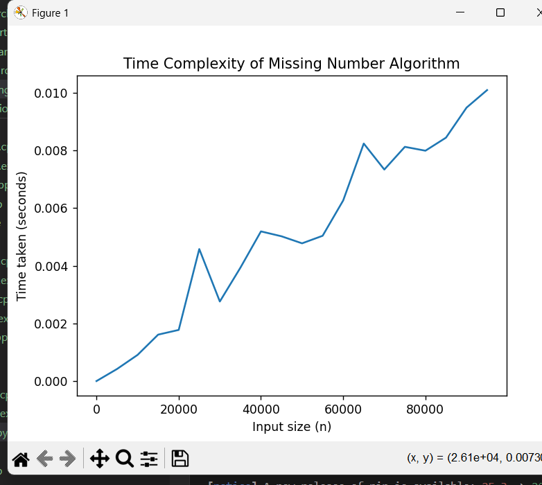

# Missing Number Algorithm – Time Complexity Analysis

##  Problem Statement
Given an array containing numbers from 1 to N with one number missing, find the missing number.

---

##  Algorithm
1. Compute the sum of numbers from 1 to N.
2. Compute the sum of elements present in the array.
3. Subtract array sum from total sum to get the missing number.

---

##  Time Complexity
- Time Complexity: **O(n)**
- Space Complexity: **O(1)**

---

##  Time Complexity Graph
The graph below shows the relationship between input size (n) and execution time.

---

##  Tools Used
- C++
- Python
- Matplotlib

